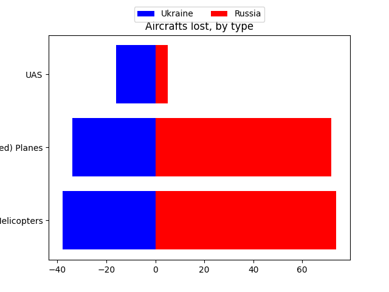
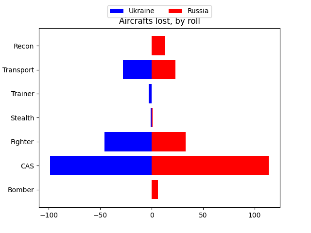
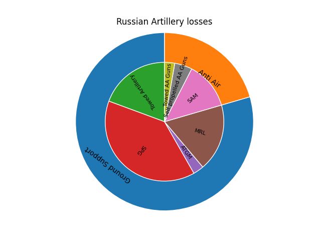
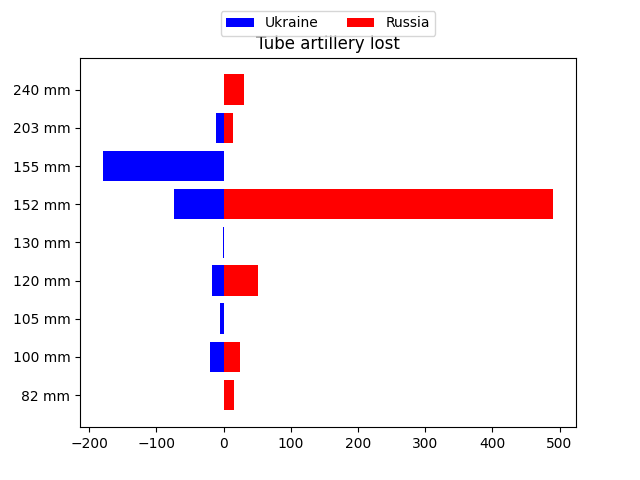
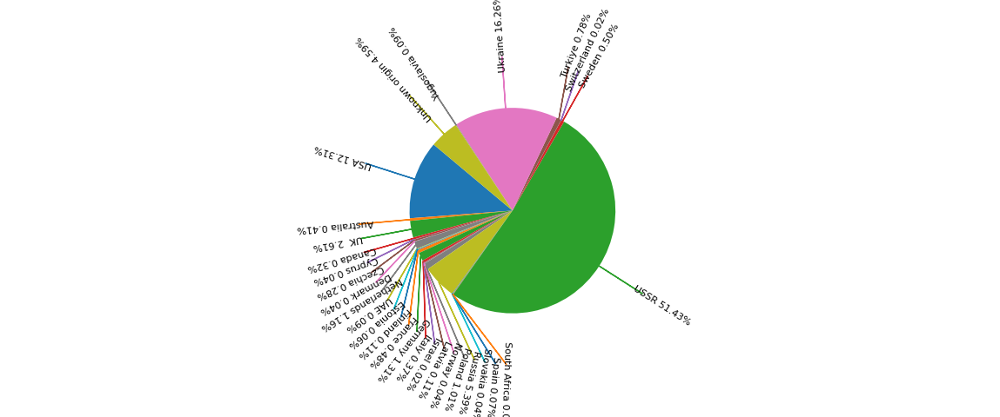

A program for analyzing Russian and Ukrainian losses, based on visually confirmed loss-data from the Oryx database
============
This project uses C# to analyze data from the Oryx organization, which is a Dutch non-profit dedicated to recording and publishing loss data from ongoing conflicts ([Source of data](https://www.kaggle.com/datasets/piterfm/2022-ukraine-russia-war-equipment-losses-oryx)) 

The data is ONLY visually confirmed losses, as such it is a severe undercount of losses suffered from both sides.

The data may also be skewed towards recognizable and famous systems, which are more likely to be photographed (Like Himars or Western Tanks) while undercounting less prestigious targets (like transport trucks).

Lessons learned from this project
-------------
C# is an excellent tool for analyzing text data, and I have become more confident using it for this. I find it quite fun to work with data in C#.

I also managed to use generators to only load part of the file, using the `yield` keyword (Actually C# does this by default when using `readline()`).

It is relatively fast to sort through and filter large datasets, if we only want a small subset. But if the data we want to find is most or all of the data, it takes a few seconds (For example, in my example project I counted all equipment based on producer, which required searching every item).

For this reason, my program has 2 stages: firstly it asks the user to set up all searches, and then it executes them all at the same time. This is far better than searching through the data every single time we want to add a new column to the output.

The most difficult part was actually plotting the data, which I have done using matplotlib, in the single python file plotExample.py. As I do not have a lot of experience with Matplotlib

How to use
---------
When you start the program, you enter command mode: Here you can enter one of the following commands (the program is not case sensitive):

	quit

This simply quits without saving anything

	output NAME

Where `NAME` is the name of the file you want to write to. Using multiple `output` commands you can write multiple outputs to different files

	Column COUNTRY TAGS ... : NAME...

This adds a new column to the current output file, when the program reaches execution mode, it will count all instances of `COUNTRU` (which is either `u` for Ukraine or `r` for Russia) has lost a piece of equipment with ALL the tags in the list of `TAGS`. To see the list of tags you can use, write `showtags` (or look at the next section in this document). You can also use the word `not` in front of a tag to look for anything which DOESN'T have the tag. `NAME` in this case is what you want to label the column (can be multiple words)

Finally, when you have all you want, you can write:

	execute

To go to execution mode, where the program counts all occurances of all your columns, in all your tables, and saves the result to `NAME.csv`.

The output also includes a `Total` which is how many pieces of equipment there are in total. Total may be less than the sum in all your rows, if one piece of equipment has multiple Tags (for instance a Strike-Fighter jet will both show up in a column of CAS (close air support) systems, and Fighter systems ) 

    load

You can execute all lines in a text file using the `load` command, You can run `load example.txt` for a good example

I have made a python program (`plotExample.py`) which takes the data from `load example.txt` and turns them into plots (See the last chapter in this document)

List of all tags
-----
If the tag matches the exact model name, it will also be counted, but I recommend against using that, as the Oryx database sometimes mis-spells the exact model names.

The different Tags this program support include nations which primarily DEVELOPED the system:

* There are  43 unique models with the tag American
* There are   3 unique models with the tag Australian
* There are  14 unique models with the tag British
* There are   2 unique models with the tag Canadian
* There are   1 unique models with the tag Cypriot
* There are   5 unique models with the tag Czech
* There are   1 unique models with the tag Danish
* There are   1 unique models with the tag Dutch
* There are   2 unique models with the tag Emirati
* There are   2 unique models with the tag Estonian
* There are   1 unique models with the tag Finnish
* There are   8 unique models with the tag French
* There are  13 unique models with the tag German
* There are   7 unique models with the tag Italian
* There are   1 unique models with the tag Iranian
* There are   2 unique models with the tag Israeli
* There are   1 unique models with the tag Latvian
* There are   1 unique models with the tag Norwegian
* There are   9 unique models with the tag Polish
* There are 187 unique models with the tag Russian
* There are   1 unique models with the tag Slovak
* There are   2 unique models with the tag Spanish
* There are   1 unique models with the tag SouthAfrican
* There are   1 unique models with the tag SouthKorean
* There are 368 unique models with the tag Soviet
* There are   6 unique models with the tag Swedish
* There are   1 unique models with the tag Swiss
* There are   4 unique models with the tag Turkish
* There are  82 unique models with the tag Ukrainian
* There are   2 unique models with the tag Yugoslav
* There are  28 unique models with the tag Unknown

Keep in mind that Soviet equipment was largely manufactured in both Russia and Ukraine.
Also keep in mind that Western equipment tend to have components from many nations,
the tag is only the country in which the company (or subsidiary) is headquartered.

Unknown equipment was so badly damaged that it could not be identified

Other Tags indicate the intended roll the equipment is going to fill:

* There are  11 unique models with the tag Ambulance
* There are  13 unique models with the tag Cleanup
* There are  71 unique models with the tag Reconnaissance
* There are  29 unique models with the tag Recovery
* There are 116 unique models with the tag Transport
* There are  21 unique models with the tag Fueltransport
* There are  56 unique models with the tag Command
* There are  15 unique models with the tag Communication
* There are  53 unique models with the tag Engineering
* There are  33 unique models with the tag EW
* There are  57 unique models with the tag Radar

EW is electronic warfare, and includes jamming and signal interception
Ambulance indicates something with a RED CROSS painted on it when it was destroyed (technically a war-crime)
Cleanup predominantly includes mine-clearing, Engineering includes mine-laying, bridge-building and excavators.
The tags only indicate the INTENDED job, 

Another useful list of tags are artillery caliber:

* There are   2 unique models with the tag 100mm
* There are   2 unique models with the tag 105mm
* There are   9 unique models with the tag 120mm
* There are   3 unique models with the tag 122mm
* There are   1 unique models with the tag 130mm
* There are   9 unique models with the tag 152mm
* There are  10 unique models with the tag 155mm
* There are   2 unique models with the tag 203mm
* There are   1 unique models with the tag 240mm
* There are   1 unique models with the tag 82mm

And there is a tag for various acronyms for artillery and missile systems

* There are  48 unique models with the tag Artillery
* There are  52 unique models with the tag AA
* There are  16 unique models with the tag MRL
* There are  22 unique models with the tag AAGun
* There are   6 unique models with the tag ATGM
* There are  29 unique models with the tag SPG
* There are  31 unique models with the tag SAM
* There are  37 unique models with the tag SPAA
* There are  14 unique models with the tag TowedAA
* There are  14 unique models with the tag TowedArtillery

A quick explanation of acronyms: AA means Anti-Air, AAGun is Anti Air Guns (also known as FLAK), SAM is surface to air missile, MRL is multiple rocket launcher, ATGM is Anti Tank Guided Missile, SPG means self-propelled gun (this includes guns attached to a vehicle used in the indirect fire role (Excluding Tanks and other), similarly SPAA are self-propelled anti-air systems, while TowedArtillery or TowedAntiAir require trucks to move around.
I am using OFFICIAL designations only, so even if all tanks can be used as impromptu SPGs, they are not counted as such

There are various tags for different ground vehicles, everything which drives under its own power has the tag Vehicle, Vehicles include:

* There are 542 unique models with the tag Vehicle
* There are  29 unique models with the tag SPG
* There are  37 unique models with the tag SPAA
* There are 103 unique models with the tag Truck
* There are  16 unique models with the tag MRAP
* There are  37 unique models with the tag APC
* There are  30 unique models with the tag IFV
* There are  62 unique models with the tag IMV
* There are  56 unique models with the tag Tank
* There are  25 unique models with the tag AFV

The acronyms mean the following: SPG and SPAA are self propelled guns or anti air systems, MRAP means mine-resistance-ambush-protected vehicle, APC's are armoured personnel carriers (For moving infantry around with some protection, but not intended to take direct part in battle), IFV's are infantry fighting vehicles (which are like APC's but more heavily armed intended to take direct part in battle), IMV are infantry mobility vehicles include Jeeps and Armoured cars which are faster and more off-road capable than APCs but sacrifice armour. AFVs means are Armoured fighting vehicles, designed to support infantry in battle (technically all Tanks are AFVs, but I am counting them seperately)

There are tags for different Soviet Tank types including:

* There are  50 unique models with the tag T-series
* There are   4 unique models with the tag T-5x
* There are  16 unique models with the tag T-6x
* There are  15 unique models with the tag T-7x
* There are  11 unique models with the tag T-8x
* There are   4 unique models with the tag T-9x
* There are   5 unique models with the tag west3gen

The T-series is for all Soviet Main Battle Tanks, and the T-5x etc. tags count all variations of tanks in each generation (roughly corresponding to the 1950s, 1960s, 1970s, 1980s and 1990s), west3gen counts all western third generation Main Battle Tanks (roughly comparable to the T90, specifically Leopard2 and variants, M1 Abrams and variants, and a polish clone of the T90)

There are some other tags for famous or common Series of vehicles, including:

* There are   3 unique models with the tag BMD-Series
* There are  20 unique models with the tag BMP-series
* There are  24 unique models with the tag BTR-Series
* There are  17 unique models with the tag MT-LB-Series
* There are   9 unique models with the tag HMMWV-Series
* There are   4 unique models with the tag Kozak-Series
* There are  10 unique models with the tag S-Series
* There are   4 unique models with the tag Tor-Series
* There are   8 unique models with the tag Buk-Series

The Russian Acronym BMD means Airborne APCs, BMP and MT-LB are soviet lines of amphibious APCs, BTR and Kozak are native Ukrainian continuation of Soviet vehicles, HMMWV (pronounced Humvee) is a western IMV

The S, Buk and Tor series are famous soviet mobile anti-air missile systems, operated by both sides.

A very diverse set of weapons used by both sides is drones, with the tag:

* There are  55 unique models with the tag Drone

This tag is used for SMALL, LOWFLYING, remote operated system, which operate WITHOUT a runway and are operated.
Do note that large Unmanned Aerial Systems, which do require a Runway, such as the Bayraktar TB2 are NOT tagged with drone.
The decision to make this split, is because it simply does not make sense to count an expendable $500 hoppy drone someone strapped a hand-grenade to as an attack helicopter.

* There are  39 unique models with the tag Aircraft

Additionally aircraft have one of these tags:

* There are  27 unique models with the tag Plane
* There are  13 unique models with the tag Helicopter

And Aircraft are either:

* There are  31 unique models with the tag MannedAir
* There are   5 unique models with the tag UAS

Here UAS stands for unmanned Aerial system, they are commonly also referred to as drones, but in size and price they are more like full-sized aircraft.

There are also tags for unique jobs planes can have (they can also have the aforementioned list of jobs above)

* There are   4 unique models with the tag Bomber
* There are  26 unique models with the tag Cas
* There are   9 unique models with the tag Fighter
* There are   5 unique models with the tag Stealth
* There are   2 unique models with the tag Trainer

Here Cas stands for Close Air Support, and means bombing enemy troops or ships at the front-line, as opposed to cities or logistics behind the lines.
Note that small drones, used in the close support role are not labeled Cas, as they have so short range, are so numerous, and fly so low that it doesn't make sense to put them in the same category as Strike-Fighter jets

Additionally, there is a tag for all SU24 jets:

* There are   3 unique models with the tag SU24-Series

Naval vessels are simply classified as Boats or Ships:

* There are   9 unique models with the tag Ship
* There are  22 unique models with the tag Boat

Example data analysis 
=====

The war in the air
------
Thanks largely to excellent Ukrainian and Russian ground-based air-defences, neither side has been able to gain air-superiority, this is reflected in the aircraft losses on both sides, here split by type of aircraft:

Russia has lost more Helicopters and Manned Planes (including both Jets and propeller aircraft) than Ukraine, but at the same time, the much smaller Ukrainian airforce are taking severe losses.

The only category where Ukraine has taken more losses than Russia is in Unmanned Aerial Systems (UAS), which are large fixed-wing drones.

Ukraine has a strong tech-sector, and has even before the war focused heavily on developing unmanned systems. Them having more losses in the category is actually a good thing for Ukraine, since it shows that they are able to use unmanned systems instead of manned systems for the most dangerous missions.

Looking at the losses by role, it looks like the most dangerous mission is Close Air Support (CAS), carried out either by strike-fighters or attack-helicopters 

Although CAS might be overrepresented, because the loss of a multi-role aircraft, counts as a loss in multiple categories, and almost all aircraft on both sides can also fill the Close Air Support role.

Even so, the losses of CAS capable platforms means neither side is able to rely on their air-force to support ground forces. Requiring both to fall back on artillery

The Artillery war
------
Artillery includes many different types of systems, filling different roles, here we see the loss of various anti-air or anti-ground systems on both sides:

Both sides are using, and loosing a wide variety of systems to provide support, and even in our age of guided missiles, tube-artillery (big guns) firing shells are still an important factor.

Looking at the caliber of the tube-artillery, we see something very interesting:

There are some calibers, which only one side uses: Firstly, Russia are using some old Soviet systems which Ukraine doesn't have, this includes the super-heavy 240mm Tyulpan Howitzer.

Additionally, we can see that NATO use slightly different calibers than the old Soviet union: Both Ukraine and Russia rely heavily on the standard Soviet 152mm caliber, but Ukraine have also received (and lost) several western system, firing the NATO standard 155mm shells.

The fact that Ukraine and NATO ue slightly different sized standard shells is a huge logistical problem for Ukraine, and they are actively working on transitioning to the NATO standard.

Additionally, we see Ukraine have also had to deal with a few Italian 105 mm systems, and we also see that one time the Ukrainians pulled a WW2 M-46 130mm field gun out of a Museum (and lost it)

The Mechanized war
------
Vehicles are the backbone of a modern army:
This, obviously, means that vehicles show up in the loss data as well, here we see all losses by category:

The Ambulances here, indicate vehicles marked with a red-cross. Attacking any vehicle or building flying the Red-Cross is a war-crime. Both sides have targeted ambulances (but Russia has done it the most)

With Russia being the attacker, they have taken far greater losses than Ukraine.

This data likely underestimate Truck losses, as soldiers on both sides are less likely to upload pictures of trucks, compared to prestigious kills like Tanks.

It looks like Ukraine has lost more Mine-Resistant Ambush Protected vehicles (Mraps) and Infantry Mobility Vehicles (Like Jeeps or Humvees). This is likely because this is a type of vehicle Ukraine has received a lot of from the west, and their relative lack of received western IFVs has likely meant the IMVs were pushed into too dangerous rolls. The failed counteroffensive large year can also be to blame for the loss of mine-resistant vehicles.

Looking at the different types of Tanks in use is also interesting:

Here the Western 3rd generation tanks (Leopard 2, M1 Abrams, and the Polish Twardy) are roughly on par with T-80 or T-90 technologically speaking. Despite the media narrative around Ukraines failed counter-offensive, losses of modern western tanks is only a tiny fraction of Total losses.

Both sides have lost enough tanks to annihilate several western nations tank forces many times over.

We also see that older tanks tend to be lost more often than newer models (The number on T-series tanks is the year they were developed). This may both be because both sides have more older tanks, or because they are less survivable.

Ukraine seems to use more T-6x series tanks than Russia, this could indicate desperation, or it could represent Ukraine sacrificing old tanks as decoys.

Even if Ukraine is desperate for tanks, the same is true for Russia: The T-5x series is the oldest Soviet Main-Battle Tank, developed shortly after WW2, and it does not belong on the modern battlefield. 

The Attrition and resupply war
-------
It is commonly believed in the west, Ukraine is completely dependent on the West, but the data suggests otherwise.

Here are the country where all equipment lost by Ukraine was originally developed:

As we see, the largest source of equipment is still the Soviet Union (this also includes Soviet Equipment given from other former Warsaw-Pact countries and captured equipment)

Additionally, Ukraine has a powerful domestic armaments sector. Ukraine did inherit many soviet designers based in Ukraine, and their strong Tech-sector has given them a highly advanced drone and UAS industry

Russia has also involuntarily donated huge stockpiles of equipment to Ukraine

Apart from this, we see that the British and American military industrial complexes are the source of much equipment (In practice, most of the equipment were originally sold to other countries, like Denmark, before being donated to Ukraine, but the Oryx database can not track who donated which piece of destroyed equipment).

The rest of the equipment come from a wide variety of sources.

When it comes to Russia, the picture is much simpler:

The vast majority of equipment is old soviet equipment (possibly modernized) or post-soviet Russian design.

(Captured) Ukrainian and Western equipment make up only a tiny fraction. This is to be expected, as Russia does not have access to spare parts for western equipment, but Ukraine has a much easier time sourcing spare parts for Russian equipment from either former Warsaw pact countries, or countries Russia has sold weapons to in the past.

It is also possible that some of the Western equipment in Russian service (And Russian equipment in Ukrainian service) was sold before the annexation of Crimea.
